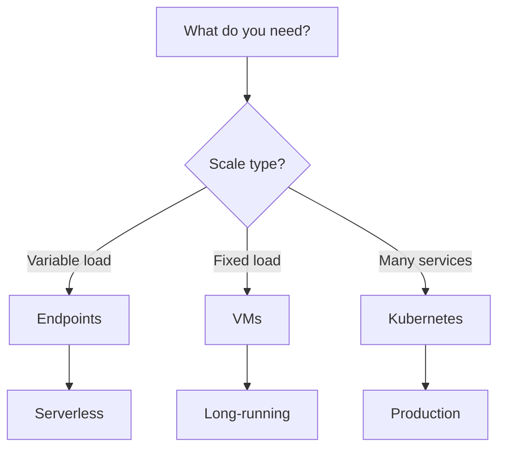

# Nebius Services

Overview of all Nebius AI Cloud services available through Claude Code.

## Serverless AI Endpoints

Deploy ML models and agent containers as auto-scaling endpoints.

**Best for:**
- LLM inference servers
- OpenClaw/NemoClaw deployments
- API services with variable load
- Real-time processing

**Quick deploy:**
```
Deploy OpenClaw endpoint with GPU and Token Factory
```

**Supported models:**
- OpenClaw (open-source agent framework)
- NemoClaw (Node.js agents)
- vLLM (LLM inference)
- Custom containers

[Full reference →](/api/endpoints)

## Compute VMs

Create virtual machines with GPU or CPU for training and development.

**Best for:**
- Model training (PyTorch, TensorFlow)
- Development environments
- Batch processing
- Long-running jobs

**Available GPUs:**
- H100 SXM (80GB) - General inference/training
- H200 SXM (141GB) - Large models
- B200 SXM (180GB) - Next-gen models
- L40S PCIe (48GB) - Cost-effective inference

**CPU options:**
- cpu-e2 (EU North, US Central)
- cpu-d3 (EU West only)

**Quick deploy:**
```
Create a GPU VM with H100 for model training
```

[Full reference →](/api/compute)

## Managed Kubernetes (mk8s)

Enterprise-grade Kubernetes clusters with GPU node support.

**Best for:**
- Production workloads
- Microservices architecture
- Auto-scaling applications
- Multi-tenant environments

**Features:**
- Managed control plane
- Auto-scaling node groups
- GPU node groups
- Built-in networking

**Quick deploy:**
```
Deploy Kubernetes cluster with 3 CPU nodes and GPU node group
```

[Full reference →](/api/kubernetes)

## Container Registry

Private Docker image registry for version control and deployment.

**Best for:**
- Storing Docker images
- CI/CD pipelines
- Multi-region replication
- Access control

**Features:**
- S3-compatible API
- Docker push/pull
- Image lifecycle policies
- Access keys and tokens

**Quick deploy:**
```
Create a container registry for my project
```

[Full reference →](/api/registry)

## VPC Networking

Virtual networks and subnets for resource isolation.

**Best for:**
- Network isolation
- Security groups
- Multi-region networks
- Custom routing

**Features:**
- Custom CIDR ranges
- Subnet management
- Security group rules
- NAT gateways

**Quick deploy:**
```
Create a VPC network with private subnets
```

[Full reference →](/api/networking)

## IAM & Authentication

Manage users, service accounts, and access control.

**Best for:**
- CI/CD authentication
- Service-to-service access
- Multi-user projects
- Audit logging

**Authentication methods:**
- Federation (interactive)
- Service accounts (automated)
- API keys (tokens)

**Quick setup:**
```
Create a service account for CI/CD automation
```

## Service Comparison

| Service | Startup Time | Auto-Scale | Cost | Best For |
|---------|--------------|-----------|------|----------|
| **Endpoints** | 1-2 min | ✅ Auto | $2.50/h GPU | Inference, APIs |
| **VMs** | 3-5 min | ❌ Manual | $2.50/h GPU | Training, Dev |
| **Kubernetes** | 10-15 min | ✅ Auto | $0.50/h + nodes | Production |
| **Registry** | Instant | ✅ Auto | $0.10/GB | Images |
| **VPC** | Instant | N/A | Free | Networking |

## Choosing the Right Service



**Need inference?**
→ Endpoints (auto-scaling)

**Need development?**
→ VMs (SSH access, persistent state)

**Need production platform?**
→ Kubernetes (multi-tenant, orchestration)

## Regional Availability

| Region | CPUs | GPUs | Kubernetes |
|--------|------|------|-----------|
| **eu-north1** (Finland) | cpu-e2 | H100, H200, B200, B300, L40S | ✅ |
| **eu-west1** (Paris) | cpu-d3 | H100, H200, B200, B300, L40S | ✅ |
| **us-central1** (US) | cpu-e2 | H100, H200, B200, B300, L40S | ✅ |

<Tip>
Some services not available in all regions. Use `nebius compute platform list` to check GPU availability in your region.
</Tip>

## Pricing

All services use **pay-as-you-go** pricing with no upfront costs.

**Example costs:**
- H100 GPU: $2.50/hour
- CPU instance: $0.10/hour
- Kubernetes cluster: $0.50/hour + per-node
- Storage: $0.10/GB

[View detailed pricing →](https://docs.nebius.dev/pricing)

## Next Steps

<CardGroup cols={2}>
  <Card title="Endpoints" icon="rocket" href="/api/endpoints">
    Deploy serverless endpoints
  </Card>
  <Card title="Compute" icon="cpu" href="/api/compute">
    Create VMs
  </Card>
  <Card title="Kubernetes" icon="cube" href="/api/kubernetes">
    Deploy clusters
  </Card>
  <Card title="Examples" icon="code" href="/examples/deploy-openclaw">
    Try templates
  </Card>
</CardGroup>
